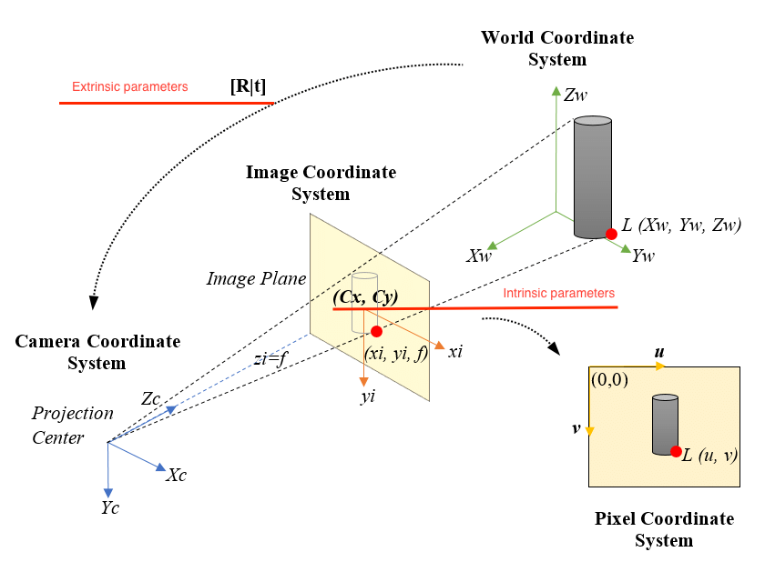

# Camera Calibration from scratch

Welcome to the camera calibration repository! This project is dedicated to demonstrating the implementation of Zhang's method for camera calibration from scratch.

## What is Camera Calibration?

[image reference](https://www.researchgate.net/figure/Pinhole-Camera-Model-ideal-projection-of-a-3D-object-on-a-2D-image_fig1_326518096)

Camera calibration involves estimating parameters related to the transformation in the pinhole camera model. This includes `intrinsic` and `extrinsic` camera parameters, which are essential for accurate image analysis and computer vision tasks.

## Zhang's Method
[Zhang, Zhengyou. "A flexible new technique for camera calibration." IEEE Transactions on pattern analysis and machine intelligence 22.11 (2000): 1330-1334.](https://ieeexplore.ieee.org/stamp/stamp.jsp?tp=&arnumber=888718)

Zhang's method offers a straightforward approach to camera calibration using corner points in a few chessboard images. It provides an efficient way to extract the necessary parameters for accurate camera modeling.

## Features

- **From Scratch Implementation:** This repository showcases a step-by-step implementation of Zhang's method for camera calibration.
- **Qualitative Comparisons:** To ensure the accuracy of the implementation, I have conducted qualitative comparisons between my implementation and the widely-used OpenCV implementation, which is expected to utilize Zhang's method.

## What is going on in each test notebook?

1. **test_homography.ipynb**  
    - Given corner points of chessboard images, find homography matrix for each image.  
    - Compare the projected points of 3D points in chessboard with the output of `cv.findHomography` function.

2. **test_initialization.ipynb**  
    - Given corner points of chessboard images and using functions implemented in (1), compute the intial camera parameters.  
    - Compare the initial parameters with the output of `cv.initCameraMatrix2D` function.

3. **test_calibration.ipynb**  
    - Given corner points of chessboard images and using functions implemented in (1) & (2), Optimize the camera parameters.  
    - Compare the projected points of 3D points in chessboard, applying the optimized camera parameter from my calibration function. 
    - The result points looks very aligned with the actual chessboard corners as like the projected points using OpenCV calibration function `cv.calibrateCamera` 

## Environment Set-up
```bash
# python 3.8.18
pip install -r requirements.txt
```
